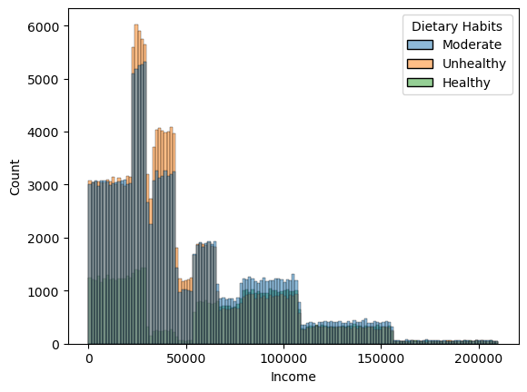
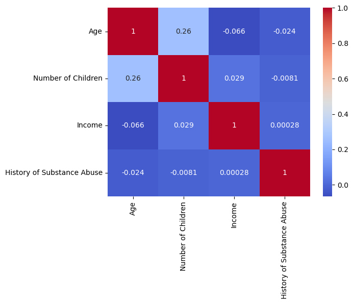
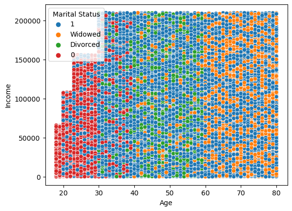
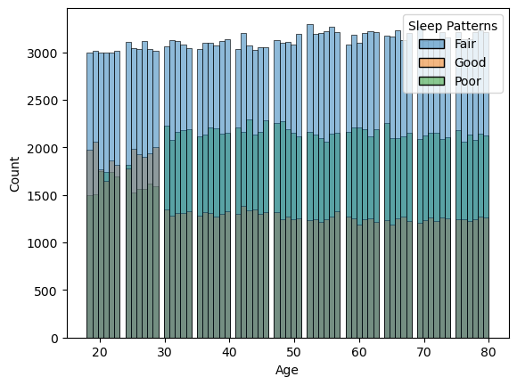
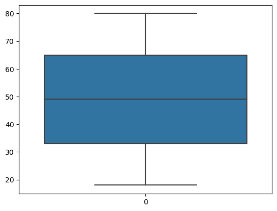

# Depressed Dataset Analysis

This project analyzes a dataset containing demographic, lifestyle, and health information of individuals to explore the relationships between various factors such as income, mental health, physical activity, and more. The primary focus of this analysis is to understand the connection between depression and other variables in the dataset.

## Dataset Overview

The dataset contains the following columns:

- **Name**: Full name of the individual.
- **Age**: Age of the individual.
- **Marital Status**: Marital status (e.g., Married, Single, Widowed, Divorced).
- **Education Level**: Highest level of education completed.
- **Number of Children**: Total number of children.
- **Smoking Status**: Whether the individual is a smoker or not.
- **Physical Activity Level**: Self-reported physical activity level (e.g., Active, Sedentary, Moderate).
- **Employment Status**: Employment status (e.g., Employed, Unemployed).
- **Income**: Annual income in USD.
- **Alcohol Consumption**: Frequency of alcohol consumption (e.g., Low, High, Moderate).
- **Dietary Habits**: Self-reported diet habits (e.g., Healthy, Unhealthy, Moderate).
- **Sleep Patterns**: Self-reported sleep patterns (e.g., Good, Poor, Fair).
- **History of Mental Illness**: Whether the individual has a history of mental illness (Yes/No).
- **History of Substance Abuse**: Whether the individual has a history of substance abuse (Yes/No).
- **Family History of Depression**: Whether the individual has a family history of depression (Yes/No).
- **Chronic Medical Conditions**: Whether the individual has any chronic medical conditions (Yes/No).

## Analysis and Visualizations

The project performs various analyses to understand how depression relates to different factors in the dataset. Several visualizations were created using Python to highlight key insights. Below are the visualizations included in the project:

### 1. **Income vs Depression Histogram**

This histogram shows the relationship between **income** and the **count** of individuals with a history of depression. It highlights how income is distributed among individuals with depression.

- **X-Axis**: Income levels (in USD).
- **Y-Axis**: Count of individuals in each income range.
- **Key Insight**: This plot helps in visualizing how income is distributed across individuals who report having depression.

### 2. **Correlation Matrix**

The correlation matrix provides insights into the relationships between all columns in the dataset. It helps identify any significant correlations between variables like income, age, history of mental illness, and more.

- **Color Scale**: The colors indicate the strength and direction of correlations. Darker colors represent stronger correlations.
- **Key Insight**: The matrix reveals strong correlations between factors such as **mental illness** history and other variables like **income**, **employment status**, and **physical activity**.

### 3. **Income vs Age Scatter Plot**

This scatter plot visualizes the relationship between **income** and **age**, providing a view of how income is distributed by age, especially among individuals with depression.

- **X-Axis**: Age of the individual.
- **Y-Axis**: Annual income in USD.
- **Key Insight**: The plot illustrates how income varies with age and the potential relationship with depression.

### 4. **Sleep Patterns vs Depression Histogram**

This histogram visualizes the relationship between **sleep patterns** and depression. It highlights how individuals with poor sleep patterns are more likely to report depression.

- **X-Axis**: Sleep patterns (Good, Poor, Fair).
- **Y-Axis**: Count of individuals in each sleep pattern category.
- **Key Insight**: Poor sleep patterns are associated with higher rates of depression.

### 5. **Income vs Depression with Hue**

This visualization uses hue to show the relationship between **income** and depression, emphasizing how different income levels correlate with depression outcomes.

- **X-Axis**: Income levels (in USD).
- **Y-Axis**: Count of individuals.
- **Key Insight**: This plot highlights how income distribution varies by depression status and provides more granular insights into how income levels correlate with mental health.

### 6. **Violin Plot of Depression by Age and Income**

The violin plot shows the distribution of depression status across different age groups and income levels, allowing for a deeper understanding of these relationships.

- **X-Axis**: Age group and income levels.
- **Y-Axis**: Depression status.
- **Key Insight**: The violin plot reveals how depression status varies with both age and income, illustrating differences in the spread of depression across various demographic groups.

### 7. **Income vs Depression Box Plot**

This box plot shows the distribution of **income** among individuals with depression compared to those without, helping to visualize any income disparities between these groups.

- **X-Axis**: Depression status (Yes/No).
- **Y-Axis**: Income levels (in USD).
- **Key Insight**: This plot highlights income disparities between individuals who report depression and those who do not, showing potential socioeconomic factors tied to mental health.

## Conclusion

This project provides valuable insights into the relationships between various lifestyle and health factors, including income, sleep patterns, and mental health. The analysis indicates that factors such as poor sleep, low income, and a history of mental illness are closely linked to depression. These findings can be used to guide strategies for mental health awareness and intervention.

The visualizations created throughout the analysis offer a deeper understanding of how depression correlates with different lifestyle and demographic factors, helping to inform potential solutions for improving mental well-being across diverse groups.